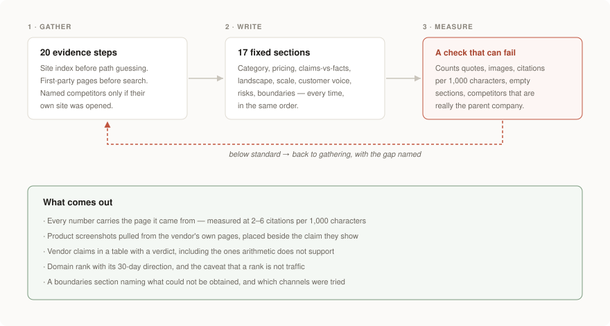
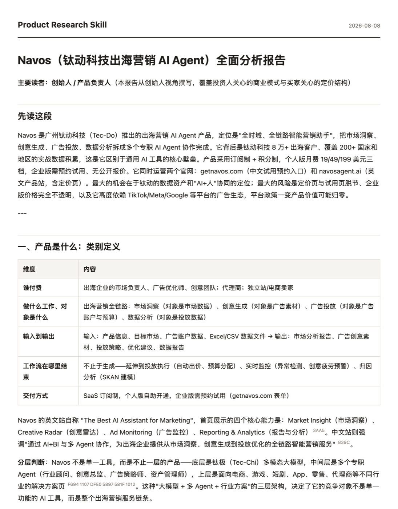

# Product Research Skill

**Point an AI agent at a software product's website. Get back a report you can make a decision from.**

[简体中文](README.zh-CN.md) · [日本語](README.ja.md) · MIT

<p align="center">
  
</p>

---

## What this is

A research method for AI agents, plus a checker that enforces it.

You give an agent a URL. It works through a fixed sequence — inventory the site before guessing at paths, read the pricing after rendering it, check every homepage claim against evidence, find the competitors whose own sites it actually opened, pull verbatim user reviews with dates, look at what changed in the last 30 days — and then writes the report into a fixed set of sections, in a fixed order, so two reports on two products can be read side by side.

**It researches internet software products**: SaaS tools, mobile and web apps, developer tools and APIs, open-source projects, and marketplaces. Anything with a website, a pricing page, and users who complain in public.

**It does not do:** physical products, stocks and equities, local businesses, or people. The evidence channels it relies on — pricing pages, docs, app stores, review platforms, repositories — only exist for software.

## What you get

A report that answers five questions, in this order:

1. **What is this, in plain language?** Feature modules described as jobs, not endpoints — plus real screenshots of the interface
2. **How does it make money?** All pricing tiers, what's actually metered, what's locked to the top plan, and the discounts that aren't on the pricing page
3. **Is the company real?** Founded when, based where, how many people, how much raised, how much revenue — each with a source or an explicit "searched, couldn't find"
4. **Who else is doing this, and where does it sit?** The category layered before it's compared, with the measure and its distortion stated
5. **What do users actually say?** Up to 10 verbatim quotes with source, date and identity — grouped by time, because sentiment drifts

Then a verdict written for *your* decision, and a boundaries section saying what couldn't be obtained and how that weakens which conclusion.

## What the output actually looks like

<p align="center">
  
</p>

That is the top of a real report, unedited. Two things to notice: the reader it is written for is stated in the first line, and the small superscripts are live citations — every number traces back to the page it came from.

Measured across six evaluation rounds on five products (a login-only subdomain, a one-page landing site, a small AI tool, a mature SaaS, and an open-source product):

| | Typical | Best round |
|---|---|---|
| Body length | 9,000–15,000 characters | 16,730 |
| Citations | 2–6 per 1,000 characters | 6.5 |
| Product screenshots, placed in context | 1–4 | 4 |
| Sections | 12–17, from a fixed list | — |
| Time per report | 5–10 minutes | — |

The full report behind that screenshot, and a shorter worked example, are in [`docs/examples/`](docs/examples/).

**What it catches that a summary does not.** From real runs:

- *"Ten years of global marketing experience"* — against a company founded in 2017. The report did the subtraction and marked the claim **overstated**.
- A case study headlined *"cut CPA by 50%"* whose own body text never mentions CPA. Three more like it in the same case library.
- A product researched from its login subdomain, where the company behind it is named on no page — but every image is served from a domain belonging to the parent, which had just filed for a Hong Kong IPO.
- A "competitor table" listing the product's own parent company and two news outlets. The checker rejects that one before it reaches a reader.

## Who it's for

| You are | You use it to |
|---|---|
| **Buying software** | Compare real costs across tools with different billing units, find the complaints before you sign, and know what to negotiate |
| **Building a product** | Map who's already in a category, find gaps nobody fills, and see from capital efficiency whether the category makes money |
| **Investing** | Check revenue quality, capital efficiency, distribution structure and moat evidence — and see which numbers need pressure-testing |
| **Running a product** | Take apart a competitor's feature architecture, user journey, friction points and release cadence |

If you have ever asked an agent to "analyse this product" and received a paraphrase of the homepage, this is the fix for that.

## Quick start

No install, no API key. Drop the skill files where your agent reads them:

```bash
git clone https://github.com/nhppyqys/product-research-skill
cp -r product-research-skill/skills/product-research ~/.claude/skills/
```

Then:

```
Use product_research_method to research https://example.com, from a buyer's perspective.
```

The entry method pulls in the sub-methods it needs at the steps where it needs them. Before you hand the report to anyone:

```bash
node scripts/check-report.mjs report.md
```

Works with any agent that can read local files and browse the web. There is nothing framework-specific in it.

## Why the reports are different

The method came out of running the same research on real products over and over, writing down every way it went wrong, and turning each failure into a rule. **42 of those failures are documented**, each with the condition under which the rule stops being true.

That produced techniques most research misses:

**A 404 page often carries the company's headcount.** SEO plugins inject `schema.org` Organization data into *every* page template, including the 404. Probe a path that doesn't exist, read the JSON-LD, and you may get employee count, founding date, office locations and the official positioning blurb in one request. → [C-02](skills/product-research/casebook.md)

**`robots.txt` is the highest-density intelligence file on most sites.** Its `Disallow` list is what a company doesn't want indexed: discount landing pages, channel-specific pricing, trial funnels. One product showed a public price of $45–329/mo while hiding `/offer/…-77-off-first-month` and `/offer/…-500-off-annually`. **The list price was never the real price.** → [C-03](skills/product-research/casebook.md)

**A login wall is not a wall.** The vendor's own tutorial videos are screen recordings of the real UI — they have to be, or they couldn't teach anyone. Two separate products turned out to ship an MCP server that appeared *nowhere* on their site or docs, visible only in a demo video. → [C-05](skills/product-research/casebook.md)

**A pricing page that scrapes empty usually isn't empty.** Prices are commonly rendered by script. One report concluded "you must log in to see pricing" — the browser showed all seven tiers plainly. **"I didn't capture it" is not "they don't provide it."** → [C-04](skills/product-research/casebook.md)

**For open-core products, the paywall is a directory.** The `LICENSE` names the exact folders under a commercial licence — the paid feature list, in language the vendor can't fudge. And licence *changes* hide in ordinary commits: one swapped 670 lines of AGPL-plus-commercial for 21 lines of MIT inside a 300-file commit titled `refactor:`. → [C-32, C-34](skills/product-research/casebook.md)

**On marketplaces, `/pricing` might belong to a seller.** The top-level namespace often falls through to seller storefronts. `/pricing` and `/security` both returned 200 — one was a shop named "PRICING", the other "Oracle's store". Status codes can't tell you which. → [C-38](skills/product-research/casebook.md)

## How it works

Four parts, each doing one job:

```
 skills/product-research/
 ├── product-research-method.md   HOW    — the sequence, plus branches per product shape
 ├── casebook.md                  WHY    — 42 field cases, each with its boundary
 ├── contract.json                ENOUGH — 20 evidence requirements + the 17 report sections
 └── (four sub-methods)                    viewpoint · landscape · reviews · recent changes
        │
        ▼
 scripts/check-report.mjs         ENFORCE — runs the contract before delivery
```

**They don't overlap.** The method contains no numbers — those live in the contract. The contract contains no reasoning — that lives in the casebook. Change a standard → edit the contract. Change an approach → edit the method. Add a lesson → add a case.

Routing is deterministic: only the entry method is keyword-routable, and the four sub-methods are loaded *by name* at named steps. The build fails if a pack has anything other than exactly one entry.

### Why a contract instead of a checklist

The method has ~69 hard requirements across ~63 sections. A checklist at the end of a long document does not get run. We know, because it wasn't:

| What was skipped | For how long |
|---|---|
| Screenshots ("environment can't render") | 5 rounds — it could, nobody tried |
| Recent-changes step | 3 rounds — the sub-method existed, no step invoked it |
| Layered market analysis | Done once, then vanished — never in the flow |
| The entire claims-vs-facts section | 1 round, unnoticed by author *and* reviewer |

That last one was caught by the checker, not by a person. **Prose has no enforcement. Code does.**

Some requirements can't be read off a finished report — how many paths you probed, how many case studies you read, whether you checked the video channel. Those go in a separate [evidence manifest](docs/evidence-manifest.md) that never ships with the report.

Skipping a step needs one of three reasons, and nothing else counts:

| Reason | Means |
|---|---|
| `blocked` | Every fallback tried and failed — say which, and what each returned |
| `absent` | The thing doesn't exist (no mobile app → no app store reviews) |
| `incapable` | The environment genuinely can't — **you must have tried, and must quote the error** |

`incapable` gets that warning because it was abused for five rounds straight.

## What makes the casebook different

Every case has seven fields. Two of them are the point:

- **Premise** — what kind of product, under what conditions. *This decides whether the case applies to what's in front of you.*
- **Does not apply when** — where following this rule makes things worse.

A case without those two is worse than no case. It hands you a conclusion without the conditions that make it true, and it gets carried into unrelated work as fact.

Not theoretical: cross-model testing found a model writing *"no customer page (`/customers` returns 404)"* into a report about a completely different product — lifted from an example in the method document. Reproduced in 2 of 3 runs. → [C-28](skills/product-research/casebook.md)

## Cross-model results

Same method, same evidence, two models, three runs each:

| | Conclusions | Failure mode | Fixable by code? |
|---|---|---|---|
| **Faster model** | Correct in 3/3 | Formatting: inline HTML, chatty preamble, leaked version string | **Yes** |
| **Slower model** | Correct, better written | **Fabricated evidence in 2/3**; leaked internal rule text in 3/3 | **No** |

The slower model produced better prose *and* invented a status code that was never observed. **Neither should run unchecked.** The practical setup is the faster model plus a mandatory checker.

## Coverage — and where it's thin

Honesty about calibration matters more than claiming completeness:

| Product shape | Field samples | Not covered |
|---|---|---|
| Self-serve SaaS | 4 | — |
| Enterprise sales | 2 | Cloud marketplace contract pricing |
| Consumer app | 1 | Chart position, paid-acquisition signals |
| Developer tool / API | 2 | Full rate-limit and error-code teardown |
| Early stage (no reviews, no cases) | 1 | — |
| Open source / open core | 1 | No sample that is *still* open-core — ours had gone fully MIT |
| Marketplace / two-sided | 1 | Listing rules; **demand side is inherently unmeasurable**, not merely untested |

Running the method on an untested shape is fine. Pretending you're calibrated for it is not — say so in the report's boundaries.

## Documentation

| | |
|---|---|
| [How it works](docs/how-it-works.md) | Architecture, routing, the contract, the checker |
| [Evidence manifest](docs/evidence-manifest.md) | What to declare and why it's a separate file |
| [Casebook](skills/product-research/casebook.md) | All 42 cases |
| [Contract](skills/product-research/contract.json) | The 20 completion requirements |
| [Example](docs/examples/sample-report.md) | A minimal report and its manifest |

## Status

The method is stable — run end to end on products across six shapes. Two things are explicitly unfinished:

- **The method files are English only, on purpose.** Keeping a second copy of a 40k-token method in sync is a losing game — it drifted once already. Docs and README are translated; the method itself has one source of truth.
- **Report branding is opt-in** via `assets/report-header.md` and the `BRAND_HEADER` variable. It ships unbranded.

## Contributing

The most useful contribution is a case. Run the method on a shape the coverage table calls thin, and when something breaks, write it up in the seven-field format — **including where the rule stops applying.** A case without a boundary won't be merged.

Bug reports on the checker are equally welcome, especially false positives. A checker that cries wolf gets ignored, and an ignored checker is worse than none.

See [CONTRIBUTING.md](CONTRIBUTING.md).

## License

MIT
